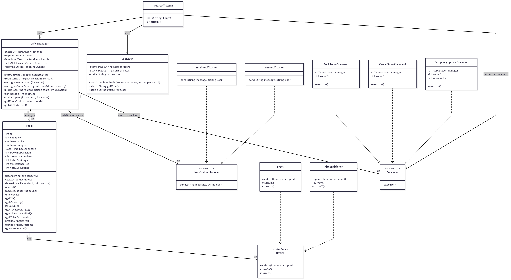

# Smart Office Application

This project is a Java-based Smart Office Management System that efficiently manages office rooms, devices, and booking systems. It implements various design patterns to ensure maintainability, scalability, and robust functionality.

# Class Diagram



## Admin Login Credentials
- Username: admin
- Password: admin123
## User Login Credentials
- Username: user
- Password: user123

## Core Features

- **Room Management System**
  - Book rooms for meetings and events
  - Cancel room bookings
  - Real-time room occupancy tracking
  - Automated room availability updates

- **Smart Device Control**
  - Intelligent light management system
  - Automated air conditioning control
  - Energy-efficient device operation
  - Centralized device monitoring

- **Authentication & Security**
  - Secure admin authentication
  - User access control
  - Booking validation system
  - Secure device operations

- **Notification System**
  - Real-time email notifications
  - SMS alerts for booking confirmations
  - Occupancy status updates
  - Automated reminder system

## Project Structure

- `com.smartoffice.SmartOfficeApp` — Main application entry point
- `com.smartoffice.auth.UserAuth` — Handles user authentication and authorization
- `com.smartoffice.command.*` — Command pattern implementation:
  - `BookRoomCommand` — Handles room booking operations
  - `CancelRoomCommand` — Manages booking cancellations
  - `OccupancyUpdateCommand` — Updates room occupancy status
- `com.smartoffice.devices.*` — Smart device management:
  - `Device` — Base interface for all devices
  - `Light` — Controls room lighting
  - `AirConditioner` — Manages room temperature
- `com.smartoffice.manager.OfficeManager` — Central management system
- `com.smartoffice.model.Room` — Room entity and operations
- `com.smartoffice.observer.*` — Notification system:
  - `NotificationService` — Core notification service
  - `EmailNotification` — Email notification implementation
  - `SMSNotification` — SMS notification implementation

## Design Patterns Used

- **Command Pattern**: For encapsulating room booking and device control operations
- **Observer Pattern**: For implementing the notification system
- **Singleton Pattern**: For managing central services
- **Factory Pattern**: For creating different types of devices
- **Strategy Pattern**: For implementing different notification strategies

## Run Instructions (Windows)

From the repository root in Command Prompt or PowerShell, run the following commands to compile and run the application:

```powershell
# Create a list of source files
dir /S /B src\*.java > sources.txt

# Compile the application
javac @sources.txt -d out

# Run the application
java -cp out com.smartoffice.SmartOfficeApp
```

Note:
- The `out` directory will be created during compilation
- Remove the `out` directory for a clean rebuild
- Make sure you have Java Development Kit (JDK) installed and properly configured